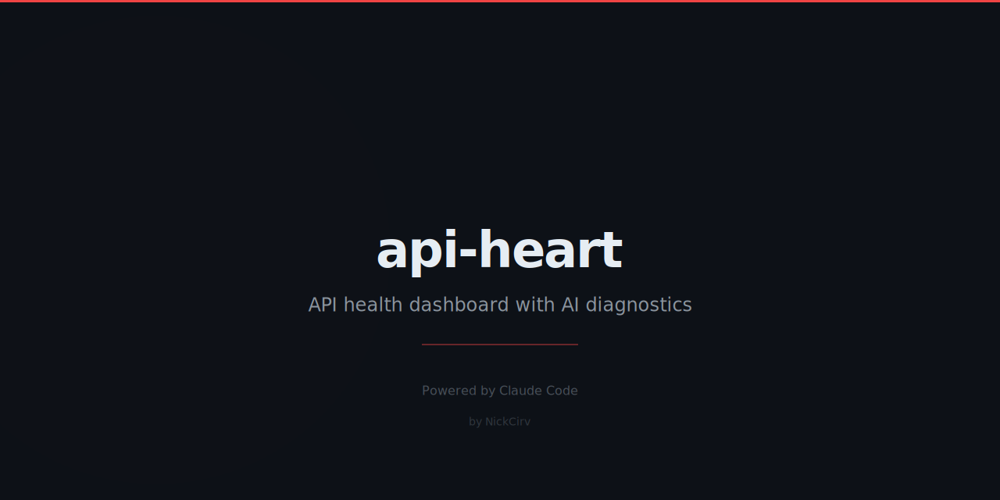

# api-heart

Instant API health checks with SSL inspection, uptime tracking, and a grade from A to F.

<p align="center">
  
  = 18" />
  
</p>

## Why

You push a change and wonder: is the API actually up? Is the SSL cert about to expire? Is it slow? `api-heart` runs a full health check in seconds — response time, status code, redirect chain, SSL validity, and a letter grade — with no config required.

## Quick Start

```bash
npx api-heart check https://api.example.com
```

## What It Does

- **Single endpoint check** — HTTP status, response time (color-coded), response size, redirect chain
- **SSL certificate inspection** — validity, issuer, subject, days until expiry (warns below 30 days, critical below 7)
- **Common endpoint probing** — automatically checks `/health`, `/api/status`, `/ping`, `/status`, `/healthz`
- **Letter grade** — A (under 200ms) through F (error/timeout/500) based on latency and SSL health
- **Continuous monitor** — poll multiple endpoints on an interval, alert on N consecutive failures, log recovery
- **History report** — uptime percentage, avg latency, p95, 24-hour sparkline, per-URL breakdown
- **Persistent history** — results stored in `~/.api-heart/history.json` and queryable by time range

## Example Output

```
  Checking https://api.example.com
  timeout: 10000ms  · probing common endpoints

  ────────────────────────────────────────────────────────────
   A   200 OK   142ms

  Status       200 OK
  Response     142ms
  Size         3.2KB

  SSL Certificate
  Valid        Yes
  Subject      api.example.com
  Issuer       Let's Encrypt
  Expires      89 days

  Common Endpoints Found
  ✓ /health  34ms
  ✓ /ping    28ms

  ────────────────────────────────────────────────────────────
  Health Grade   A   Excellent
```

## Commands

| Command | Description |
|---------|-------------|
| `api-heart check <url>` | Run a health check on a single URL |
| `api-heart monitor <config>` | Continuously monitor endpoints from a YAML/JSON file |
| `api-heart report` | Show a health report from stored history |

## Options

### `check`

| Flag | Description | Default |
|------|-------------|---------|
| `-t, --timeout <ms>` | Request timeout in milliseconds | `10000` |
| `-v, --verbose` | Show all probed endpoints, not just found ones | off |
| `--no-common` | Skip common endpoint probing | off |

### `monitor`

| Flag | Description | Default |
|------|-------------|---------|
| `-i, --interval <seconds>` | Check interval | `60` |
| `-f, --fail-threshold <n>` | Consecutive failures before alert | `3` |

### `report`

| Flag | Description | Default |
|------|-------------|---------|
| `-h, --hours <n>` | Hours of history to include | `24` |
| `--url <url>` | Filter report to a specific URL | all |

## Monitor Config (YAML)

```yaml
endpoints:
  - url: https://api.example.com/health
    name: Production API
    timeout: 5000
  - url: https://staging.example.com/ping
    name: Staging
```

## Use in CI

```yaml
- name: API health gate
  run: npx api-heart check https://api.example.com
```

Exit code is `0` on success, `1` on failure — works naturally in pipelines.

## Install Globally

```bash
npm i -g api-heart
```

## License

MIT
